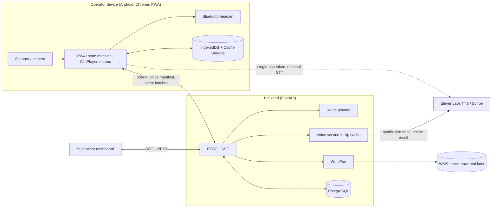
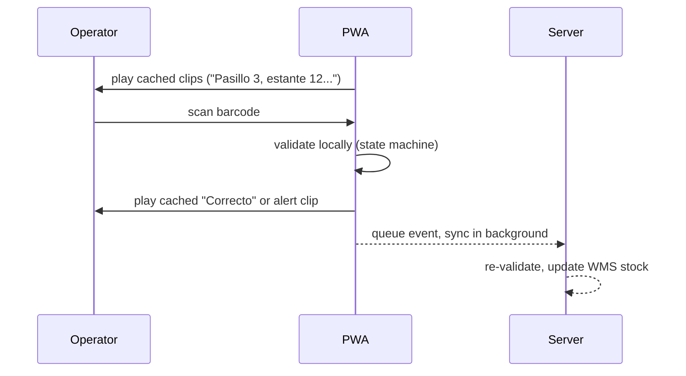

# Macenplast Voice Picking — Build Plan for Claude Code

Source: "Propuesta de proyecto y ficha técnica, software de instrucciones por voz para operarios de picking" (Macenplast). Requirement IDs below (RF-01..07, RNF-01..05, R-01..04) refer to that document's functional requirements, non-functional requirements, and expected results.

## 0. How to use this file

1. Put this file at the repo root as `PLAN.md`. Phase 0 turns section 2 into `CLAUDE.md`.
2. Work one phase per Claude Code session: start in plan mode, review the plan, approve, build, verify against that phase's acceptance criteria, then `/clear` before starting the next phase.
3. Paste the "Prompt for Claude Code" block at the end of each phase — it just points back at this file, so the spec itself stays in one place and doesn't drift between phases.
4. Don't skip or reorder phases; each one lists what it depends on.
5. When Claude Code disagrees with a decision in section 3, it should stop, ask, and record the resolution as an ADR in `docs/adr/`.

## 1. What we're building

A voice-guided picking system for Macenplast's storage and dispatch area. The operator wears a Bluetooth headset and carries a scanner. The system speaks each pick instruction in Spanish (aisle, bay, level, reference, quantity), the operator confirms by scanning a barcode, and a mismatch blocks progress (Poka-Yoke). Every validated pick updates inventory in the WMS in real time and leaves an audit trail. Supervisors get a live board, an incident queue, and KPI reports comparing the current process against the voice process.

Out of scope, matching the source document: molds and plastic injection.

Additions beyond the source document — flagged so they're not mistaken for client requirements, and worth confirming with Macenplast before or during the build:
- Quantity confirmation, not just SKU scanning (the source document only specifies scanning the product barcode).
- Optional location-label scan, to catch an operator at the wrong bay before they scan the right SKU.
- Supervisor override after repeated mismatches, so the hard block (RF-04) can't strand an operator indefinitely.
- A BASELINE session mode (screen-driven, non-blocking) alongside VOICE mode, so the missing baseline numbers in the source document (only idle time has one, at 35%) get measured with the same software instead of estimated separately.

## 2. Project rules — Phase 0 turns this into CLAUDE.md

**Language.** Code, comments, commit messages, README, ADRs: English. Everything the operator hears or reads on screen: Spanish (Colombia), kept in catalog files (`phrases.es.yaml`, `i18n/es.json`) — never hard-coded inside logic.

**Python.** 3.12, `src/` layout, `pathlib` for all paths, PEP 8 via ruff, full type hints checked by mypy strict, Google-style docstrings, pytest (hypothesis for property-based tests on the state machine and number-to-speech logic).

**TypeScript.** Strict mode, ESLint + Prettier, Vitest for unit tests, Playwright for e2e.

**Repo.** Conventional commits (`feat:`, `fix:`, `test:`, `docs:`, `chore:`), small commits, one branch per phase (`phase/03-voice-service`), merged to `main` via PR. Mermaid diagrams in the README. GitHub Actions CI. SonarCloud config can go in during Phase 0 but should never block a build.

**Working rules for Claude Code.**
- Tests first for anything with logic (state machine, routing, number-to-speech, offline sync). Implementation after.
- Never call the live ElevenLabs API from automated tests — mock it. Live smoke tests are marked `@pytest.mark.live` and skipped by default.
- Never commit secrets. `.env` is git-ignored; `.env.example` is committed.
- The ElevenLabs API key lives only on the backend. The browser never sees it — client-side STT uses a short-lived token minted by the backend, not the key itself.
- Don't persist operator audio. Only parsed commands and transcripts of committed voice commands are stored, and only when voice input (Phase 8) is enabled.
- Before coding against ElevenLabs, verify current model IDs, endpoints, and output formats against their docs — names in this plan were correct when written and may have moved since.
- Definition of done for every phase: lint, type check, and tests pass; every acceptance criterion in that phase is demonstrably met; the README gets a short update; `docs/PROGRESS.md` gets an entry (what was built, deviations from this plan, open questions for the next phase).

## 3. Key decisions and why

| Area | Decision | Why |
|---|---|---|
| Voice output | ElevenLabs TTS, Flash v2.5 model, but never called in the hot path | Flash is ElevenLabs' low-latency model (roughly 75 ms inference, 125–225 ms end-to-end under good network) and supports Spanish with streaming. But plant wifi plus the offline requirement (RNF-03) make a live cloud call between scan and confirmation a threat to the sub-1-second requirement (RNF-02). So audio is generated ahead of time and played from the device. |
| Audio strategy | Two layers: a static clip library (numbers, commands, alerts) generated at build time, plus dynamic per-SKU clips synthesized once on the backend, cached by content hash, and prefetched to the device when an order is assigned | Keeps the real ElevenLabs voice while playback is fully local. Cost stays negligible since each distinct phrase is synthesized once and reused. |
| Fallback voice | Browser `speechSynthesis` (es-CO/es-ES) if a needed clip is missing on-device | The operator is never left in silence, even on a cache miss or first run. |
| Voice input | ElevenLabs Scribe v2 Realtime over WebSocket, closed command vocabulary, push-to-talk, feature-flagged, built last (Phase 8) | Scribe supports Spanish with sub-150ms partials. The scanner stays the primary confirmation channel — voice input is a convenience for short commands ("siguiente", "repetir", "cantidad diez"), which is also what keeps ASR accuracy manageable on a noisy floor (RNF-04). |
| Operator client | React + TypeScript + Vite, built as a PWA, targeting an Android handheld running Chrome | Installable, offline-capable, works with rugged Android scanners, and a hardware scanner in keyboard-wedge mode just works as text input. |
| Scanner input | Keyboard-wedge detection (fast keystroke timing) as primary; `BarcodeDetector` with a ZXing-js fallback via the camera as backup | Covers both dedicated Bluetooth scanners and a lost/broken scanner. |
| Backend | Python 3.12, FastAPI, SQLAlchemy 2, Alembic, PostgreSQL 16 | Matches the conventions above; gives a typed OpenAPI contract the frontend can generate a client from. |
| WMS integration | Hexagonal `WmsPort` interface, with a `MockWmsAdapter` (Postgres-backed, default) and a `RestWmsAdapter` stub | The real WMS isn't named in the source document. The mock lets the whole system be built, tested, and piloted now; swapping in the real system later is isolated to one adapter. |
| Routing | Pure function `plan_route`; default nearest-neighbor / S-shape (serpentine) heuristic; optional OR-Tools optimization behind a flag for larger orders | Simple and testable by default; upgradeable without changing the interface. |
| Pick state machine | One state machine, specified once, implemented twice — Python on the server, TypeScript on the offline client — both tested against the same shared JSON test vectors | The client must keep working with no connection; the server stays the source of truth. Shared vectors are what keeps the two implementations from drifting apart. |
| Offline support | IndexedDB (Dexie) plus an event outbox with idempotency keys, synced in batches when connectivity returns | Satisfies RNF-03; makes RF-05 (real-time inventory update) eventually consistent, with server-side conflict flags surfaced to supervisors. |
| Supervisor dashboard | Server-Sent Events for live updates | One-directional live updates are all it needs; simpler to build and debug than WebSockets. |
| Measuring results | Every session is tagged BASELINE (on-screen list, mismatches logged but non-blocking) or VOICE (spoken, blocking) | Produces both the missing baseline numbers and the before/after comparison for R-01–R-03 from one codebase, addressing the "no measurable targets" gap flagged in the earlier document review. |
| Deployment | Docker Compose — Caddy (reverse proxy + automatic HTTPS), API, Postgres, clip storage volume — on the plant LAN or a small cloud VM | HTTPS is mandatory (microphone access and service workers require a secure context); Caddy makes that close to zero-config. |

## 4. Architecture



Hot path for one pick line — everything here is local to the device, nothing waits on the network:



Latency budget for scan-to-audible-confirmation (RNF-02 requires under 1 second):

| Step | Target |
|---|---|
| Scan captured and parsed | under 10 ms |
| Local state-machine validation | under 5 ms |
| Audio playback start (buffer preloaded, AudioContext already running) | under 100 ms |
| In-app total, p95 | under 300 ms |
| Bluetooth headset codec delay | measure on the actual headset model; adds on top of the above |

Browser constraints Claude Code needs to design around: an `AudioContext` only starts after a user gesture, so a "Start shift" tap unlocks audio for the whole session; the Screen Wake Lock API keeps the device from sleeping mid-shift; audio output should default to the paired Bluetooth device.

## 5. Repository layout

```
macenplast-voice-picking/
├── CLAUDE.md                    # generated in Phase 0 from section 2
├── PLAN.md                      # this file
├── README.md                    # overview + Mermaid diagrams
├── Makefile                     # up, down, test, lint, seed, e2e
├── docker-compose.yml           # dev: postgres, api, web
├── docker-compose.prod.yml      # prod: caddy, api, postgres
├── .github/workflows/ci.yml
├── apps/
│   ├── api/
│   │   ├── pyproject.toml
│   │   ├── alembic/
│   │   ├── src/macenplast/
│   │   │   ├── config.py
│   │   │   ├── db/              # models, session, seed
│   │   │   ├── domain/          # pick_machine, routing, numbers_es
│   │   │   ├── ports/           # WmsPort
│   │   │   ├── adapters/        # mock_wms, rest_wms
│   │   │   ├── voice/           # tts, clip_cache, phrases, stt_token
│   │   │   ├── api/             # routers, auth, sse, schemas
│   │   │   └── reports/         # KPI queries
│   │   └── tests/
│   └── web/
│       ├── src/
│       │   ├── operator/        # PWA: session flow, scanner, audio, machine
│       │   ├── supervisor/      # dashboard
│       │   ├── shared/          # generated API client, i18n, offline db
│       │   └── sw.ts            # service worker
│       └── e2e/                 # Playwright
├── packages/machine-vectors/    # shared JSON test vectors for the pick machine
├── tools/voice-clips/           # static clip generator (build-time ElevenLabs calls)
├── analysis/                    # pilot analysis scripts, notebooks
└── docs/
    ├── adr/
    ├── PROGRESS.md
    ├── runbook.md
    ├── noise-test-protocol.md
    └── operator-guide.es.md
```

## 6. Domain model and the pick state machine

**Tables (summary).** `operators`, `devices`, `locations` (aisle, bay, level, x/y for routing, location barcode), `skus` (code, description, `voice_alias`, unit), `sku_barcodes` (many per SKU), `stock_levels`, `pick_orders`, `pick_lines`, `pick_sessions` (mode: BASELINE or VOICE; operator; device; start/end), `pick_events` (append-only audit log, unique `client_event_id` for idempotent sync), `incidents`, `voice_clips` (content hash, text, voice, model, format, file path), `surveys` (for the fatigue/ease-of-use measurement).

**Pick line state machine** (identical semantics on server and client):

| State | Event | Next state | Effect |
|---|---|---|---|
| PENDING | PRESENT | AWAITING_LOCATION if location check is on, else AWAITING_SCAN | speak instruction (aisle, bay, level, reference) |
| AWAITING_LOCATION | SCAN(correct location label) | AWAITING_SCAN | speak "ubicación correcta" |
| AWAITING_LOCATION | SCAN(wrong label) | BLOCKED | alert clip, attempts += 1 |
| AWAITING_SCAN | SCAN(expected barcode) | AWAITING_QTY | speak "Cantidad, N" |
| AWAITING_SCAN | SCAN(other barcode) | BLOCKED | alert clip, attempts += 1 |
| BLOCKED | SCAN(expected barcode) | AWAITING_QTY | speak confirmation |
| BLOCKED | attempts reach 3 | NEEDS_OVERRIDE | speak "llame al supervisor" |
| NEEDS_OVERRIDE | OVERRIDE(supervisor) | AWAITING_QTY | log override, who approved it |
| AWAITING_QTY | QTY(n = expected) | DONE | speak "Correcto", queue sync |
| AWAITING_QTY | QTY(n below expected) | SHORT_PENDING | ask operator to confirm the shortage |
| AWAITING_QTY | QTY(n above expected) | BLOCKED | alert clip |
| any active state | EXCEPTION(short, empty_location, damaged) | EXCEPTED | create incident, advance to next line |
| any active state | REPEAT | same state | re-speak current instruction |

In BASELINE mode the same machine still validates and logs every mismatch, but doesn't block progress — the event is logged as `MISMATCH_UNBLOCKED` — and instructions render on screen instead of being spoken. This is what produces a real, current baseline instead of the 35% figure the source document cites with no stated source.

Quantity handling: operator scans the SKU once, then confirms quantity (on-screen keypad, hardware volume-button taps, or voice once Phase 8 lands). A per-line `scan_each_unit` flag switches high-value lines to one scan per unit.

Phrase-writing rule for the catalog: use nominal number forms ("Cantidad, veintiuno") rather than noun phrases ("veintiún cajas"), to sidestep Spanish gender agreement without building a full grammar engine.

## 7. Phases

Each phase below has a goal, dependencies, deliverables, acceptance criteria, and a prompt block to paste into a fresh Claude Code session.

---

### Phase 0 — Repo bootstrap

**Depends on:** nothing.
**Deliverables:** repo skeleton per section 5; `CLAUDE.md` generated from section 2; `docker-compose.yml` that brings up an empty FastAPI app, an empty Vite app, and Postgres; GitHub Actions CI running lint + type-check + test (empty test suites are fine at this stage) on both apps; `Makefile` with `up`, `down`, `test`, `lint`; `docs/PROGRESS.md` started; `docs/adr/0001-architecture.md` capturing the table in section 3 as an ADR.

**Acceptance criteria:**
- `make up` brings up all three services; API health endpoint and web dev server both respond.
- CI is green on a trivial PR.
- `CLAUDE.md` exists and matches section 2.

**Prompt for Claude Code:**
> Read `PLAN.md` in this repo, specifically sections 0, 2, 3, and 5. Execute Phase 0 only: bootstrap the repository exactly as described (structure, CLAUDE.md, docker-compose, CI, Makefile), and write ADR 0001 capturing the architecture decisions in section 3. Stop after Phase 0's acceptance criteria are met — don't start on domain models or later phases. Ask me before deviating from the repo layout in section 5.

---

### Phase 1 — Domain model, migrations, pick state machine

**Depends on:** Phase 0.
**Deliverables:** SQLAlchemy models and Alembic migrations for every table in section 6; a seed script building a small realistic warehouse (a few aisles/bays/levels, ~30 SKUs with barcodes, a handful of open orders); the pick state machine in `domain/pick_machine.py`, pure and side-effect-free (it returns effects to be executed by the caller, it doesn't call the DB or the voice service itself); the same machine ported to TypeScript in `apps/web/src/shared/pickMachine.ts`; shared test vectors in `packages/machine-vectors/*.json` covering every transition in the table in section 6, including the 3-attempt override path and every EXCEPTION branch; both implementations tested against the same vectors.

**Acceptance criteria:**
- `pytest` and `vitest` both pass, both consuming the same vector files (fixture loaders on each side, not duplicated test data).
- Property-based tests (hypothesis) confirm the machine never reaches DONE without a matching scan+quantity, and never leaves BLOCKED without either a correct scan or a logged override.
- Seed script is idempotent (`make seed` twice doesn't duplicate rows).

**Prompt for Claude Code:**
> Read `PLAN.md`, sections 3 (row "Pick state machine"), 5, and 6. Execute Phase 1 only: build the domain model, migrations, seed data, and the pick line state machine in both Python and TypeScript, sharing one set of JSON test vectors between them as described in section 6. Write the state machine as pure logic — no DB or network calls inside it. Don't build API routes or the voice service yet; stub anything you need to. Confirm the acceptance criteria in Phase 1 of PLAN.md before stopping.

---

### Phase 2 — WMS port and route planning

**Depends on:** Phase 1.
**Deliverables:** `ports/wms_port.py` defining `WmsPort` (methods like `get_stock`, `reserve`, `commit_pick`, `release`); `adapters/mock_wms.py` implementing it against the local Postgres tables from Phase 1; `adapters/rest_wms.py` as a typed stub raising `NotImplementedError` with a clear docstring on what a real integration needs (base URL, auth, endpoint shapes to confirm with Macenplast); `domain/routing.py` with `plan_route(locations: list[Location]) -> list[Location]` implementing the default serpentine heuristic, plus an OR-Tools-based optimizer behind a `ROUTING_STRATEGY` config flag.

**Acceptance criteria:**
- Unit tests prove `MockWmsAdapter.commit_pick` decrements stock exactly once per idempotency key, even if called twice.
- `plan_route` tests cover: single-aisle orders, multi-aisle orders, and a tie-breaking rule that's documented.
- Switching `ROUTING_STRATEGY` doesn't change the `WmsPort` or state-machine contracts.

**Prompt for Claude Code:**
> Read `PLAN.md`, sections 3 (rows "WMS integration" and "Routing") and 6. Execute Phase 2 only: build the `WmsPort` interface, the mock adapter backed by Phase 1's tables, a stub real adapter, and the route planner with its default heuristic plus an optional OR-Tools mode behind a config flag. Don't touch the API layer or voice service yet. Confirm Phase 2's acceptance criteria before stopping.

---

### Phase 3 — Voice service and clip pipeline

**Depends on:** Phase 1.
**Deliverables:** `voice/phrases.py` + `phrases.es.yaml` — the Spanish phrase catalog (instructions, confirmations, alerts, numbers 0–999 using the nominal-form rule from section 6); `voice/tts.py` wrapping the ElevenLabs TTS API (confirm current SDK/model ID before coding); `voice/clip_cache.py` — content-hash-keyed cache, persisted as rows in `voice_clips` plus files on disk/volume; `tools/voice-clips/build_static_clips.py` — a script that synthesizes the entire static catalog once (numbers, fixed phrases, alerts) and is run in CI or manually, not at request time; a dynamic-clip endpoint that synthesizes a SKU's `voice_alias` on first use and caches it; a "voice manifest" API response listing which clip hashes a device needs for an assigned order, so the PWA (Phase 5) can prefetch.

**Acceptance criteria:**
- All tests mock the ElevenLabs client; one `@pytest.mark.live` test (skipped by default) proves the real call works end-to-end when explicitly run with an API key.
- Requesting the same phrase twice produces one synthesis call and one cache hit.
- `build_static_clips.py` run against a fresh cache produces every clip needed for a full seeded order with zero dynamic-clip fallbacks at runtime.

**Prompt for Claude Code:**
> Read `PLAN.md`, sections 2 (working rules on ElevenLabs), 3 (row "Audio strategy"), and 6 (phrase-writing rule). Execute Phase 3 only: build the Spanish phrase catalog, the ElevenLabs TTS wrapper, the content-hash clip cache, the static clip build script, and the voice manifest endpoint. Verify the current ElevenLabs Python SDK and model ID against their docs before writing the wrapper — don't assume the model name in PLAN.md is still current. Mock ElevenLabs in all non-live tests. Confirm Phase 3's acceptance criteria before stopping.

---

### Phase 4 — Backend API

**Depends on:** Phases 1–3.
**Deliverables:** FastAPI routers for: operator auth (PIN-based, simple — full SSO is out of scope), sessions (start BASELINE/VOICE, end), orders (assign, get next line, get voice manifest), events (submit single or batched pick events, idempotent on `client_event_id`), incidents (RF-06), supervisor override, performance report queries (RF-07, expanded in Phase 6), and an SSE stream (`/dashboard/stream`) emitting session/line/incident updates; OpenAPI schema exported for the frontend's generated client; role-based access (operator vs supervisor) — this is an addition beyond the source document, which specifies no access-control requirement, but is needed so an operator can't grant their own override.

**Acceptance criteria:**
- Integration tests drive a full order through the API using the state machine and mock WMS from Phases 1–2, checking that stock updates and audit events land correctly, including a BLOCKED → override → DONE path.
- SSE stream is covered by at least one integration test using a test client that can consume server-sent events.
- OpenAPI JSON is committed or generated in CI so Phase 5 can codegen a client against it.

**Prompt for Claude Code:**
> Read `PLAN.md`, sections 3 (rows "Supervisor dashboard" and anything touching auth/roles), 4, and 6. Execute Phase 4 only: build the FastAPI routers, SSE dashboard stream, and role-based access, wiring together the state machine (Phase 1), WMS port (Phase 2), and voice service (Phase 3). Export the OpenAPI schema for client codegen. Don't build the frontend yet. Confirm Phase 4's acceptance criteria before stopping.

---

### Phase 5 — Operator PWA (core voice-picking flow)

**Depends on:** Phase 4.
**Deliverables:** React PWA with: shift start screen (unlocks AudioContext, requests wake lock, picks up assigned order); the picking screen driving the shared TypeScript state machine from Phase 1; `ClipPlayer` that plays cached clips from Cache Storage, falling back to `speechSynthesis`; scanner input handling both keyboard-wedge and camera (`BarcodeDetector`/ZXing) modes; IndexedDB (Dexie) event outbox with background sync on reconnect; service worker precaching the app shell and the current order's voice manifest; a visible BASELINE/VOICE mode indicator so the operator and any observer know which session type is running.

**Acceptance criteria:**
- Playwright e2e: complete a full order offline (airplane mode after initial load), then reconnect and confirm all events sync with correct server-side stock changes.
- Manual/scripted timing check meets the latency budget in section 4 on at least a mid-range Android device or emulator throttled to match one.
- BASELINE mode visibly differs from VOICE mode (on-screen list vs. spoken instructions) and logs mismatches without blocking.

**Prompt for Claude Code:**
> Read `PLAN.md`, sections 3 (rows "Operator client", "Scanner input", "Fallback voice", "Offline support"), 4, and 6. Execute Phase 5 only: build the operator PWA's core picking flow against the Phase 4 API, using the shared state machine from Phase 1 and the voice manifest from Phase 3. Implement both scanner input modes and the offline outbox. Don't build the supervisor dashboard yet. Confirm Phase 5's acceptance criteria before stopping, including the offline Playwright test.

---

### Phase 6 — Supervisor dashboard and KPI reporting

**Depends on:** Phase 4 (can run in parallel with Phase 5).
**Deliverables:** a dashboard app (or route within the same web app) consuming the SSE stream: live view of active sessions, current line per operator, incident queue with an override action; a reports section computing, per date range and per mode (BASELINE vs VOICE): pick lines per hour, mismatch/error rate, idle time (derived from gaps between line completions), and incident counts — this is what turns R-01/R-02/R-03 into numbers instead of unmeasured claims; a survey form operators fill in after a shift (short, a handful of Likert items on perceived effort/fatigue) feeding the `surveys` table, since fatigue can't be inferred from event timestamps alone.

**Acceptance criteria:**
- Dashboard reflects a live session within one SSE round-trip in a manual test.
- Report queries are covered by tests using seeded BASELINE and VOICE sessions with known outcomes, and the computed numbers match hand-calculated expectations.
- Survey submissions are queryable alongside session mode.

**Prompt for Claude Code:**
> Read `PLAN.md`, sections 3 (rows "Supervisor dashboard" and "Measuring results") and 6. Execute Phase 6 only: build the supervisor dashboard against the Phase 4 SSE stream and REST API, plus the KPI report queries comparing BASELINE and VOICE sessions, plus the post-shift survey form and storage. Write tests against seeded data with known expected KPI outputs. Confirm Phase 6's acceptance criteria before stopping.

---

### Phase 7 — Pilot protocol and measurement

**Depends on:** Phases 5 and 6.
**Deliverables:** `docs/noise-test-protocol.md` — a short, concrete procedure for measuring ASR-irrelevant things first: playback intelligibility and the RNF-02 latency budget under real plant noise and a real Bluetooth headset, before trusting any pilot numbers; `analysis/` scripts that pull KPI data via the Phase 6 report queries (or DB directly) and produce a before/after comparison (idle time, error rate, survey scores) as a simple report — this is where R-01 through R-04 actually get evaluated against real pilot data instead of assumed; `docs/operator-guide.es.md`, a short Spanish one-pager for operators covering shift start, what each alert sound means, and how to call a supervisor override.

**Acceptance criteria:**
- Protocol document is concrete enough that someone at Macenplast could run it without Claude Code present (named steps, what to record, sample size guidance).
- Analysis script runs against seeded demo data end-to-end and produces a readable report.
- Operator guide reviewed for plain, non-technical Spanish.

**Prompt for Claude Code:**
> Read `PLAN.md`, section 3 (row "Measuring results") and section 7's Phase 6 summary. Execute Phase 7 only: write the noise/latency test protocol, the pilot analysis scripts against the Phase 6 KPI queries, and the Spanish operator guide. This phase is mostly documentation and analysis code, not new application features — don't add new API endpoints unless a report genuinely needs one that Phase 6 doesn't expose. Confirm Phase 7's acceptance criteria before stopping.

---

### Phase 8 — Voice input (optional, feature-flagged)

**Depends on:** Phase 5.
**Deliverables:** backend endpoint minting short-lived ElevenLabs Scribe tokens; client-side push-to-talk capture streaming to Scribe v2 Realtime over WebSocket; a small closed grammar (`siguiente`, `repetir`, `cantidad <número>`, `ayuda`) parsed from committed transcripts, feeding the same state machine events Phase 5 already handles — no new machine states; a `VOICE_INPUT_ENABLED` feature flag, off by default, so a pilot can run scan-only first and add voice commands later without a redeploy.

**Acceptance criteria:**
- With the flag off, nothing in Phase 5's flow changes or calls Scribe.
- With the flag on, a scripted test (mocked WebSocket) proves each grammar command maps to the correct state machine event.
- No raw audio is persisted; only committed transcripts of recognized commands, timestamped, are logged.

**Prompt for Claude Code:**
> Read `PLAN.md`, sections 2 (rule on not persisting audio), 3 (row "Voice input"), and 6. Execute Phase 8 only: add feature-flagged voice input using ElevenLabs Scribe v2 Realtime, mapping a small fixed Spanish command grammar onto the existing state machine's events — don't add new states. Verify the current Scribe API (token minting, WebSocket message shapes) against ElevenLabs' docs before coding. Confirm Phase 8's acceptance criteria before stopping.

---

### Phase 9 — Hardening and deployment

**Depends on:** all prior phases.
**Deliverables:** `docker-compose.prod.yml` with Caddy, HTTPS, and volume-backed Postgres and clip storage; `docs/runbook.md` covering backup/restore, rotating the ElevenLabs key, and reading logs/incidents; a security pass — rate limiting on auth, checking role checks are enforced on every route added since Phase 4, confirming the ElevenLabs key never reaches the client bundle; a load/soak test simulating several concurrent operator sessions against the mock WMS.

**Acceptance criteria:**
- `docker compose -f docker-compose.prod.yml up` serves the app over HTTPS with a self-signed or Caddy-issued cert in a test environment.
- A grep/build-output check confirms no secret ever lands in the web bundle.
- Runbook is followed once, live, by someone other than the session that wrote it (or at minimum re-read critically in a fresh session) to catch gaps.

**Prompt for Claude Code:**
> Read `PLAN.md`, section 3 (row "Deployment") and section 2's security-relevant rules. Execute Phase 9 only: build the production Docker Compose setup with Caddy and HTTPS, write the runbook, and do a security pass confirming the ElevenLabs key never reaches the client and that role checks from Phase 4 are enforced everywhere. Run a basic concurrent-session load test against the mock WMS. Confirm Phase 9's acceptance criteria before stopping.

---

## 8. Requirement traceability

| Source requirement | Description (source document) | Covered by |
|---|---|---|
| RF-01 | Conversión de orden a voz (TTS) — each pick line becomes a spoken location + reference | Phase 3 (voice service), Phase 5 (playback) |
| RF-02 | Guiado de ruta — optimal travel sequence between locations | Phase 2 (`plan_route`), Phase 3 (route turned into speech), Phase 5 (playback) |
| RF-03 | Captura por escáner — operator confirms each pick by scanning, no screen touch needed | Phase 1 (state machine SCAN events), Phase 5 (scanner input) |
| RF-04 | Validación Poka-Yoke — match confirms by voice, mismatch alerts and blocks | Phase 1 (BLOCKED/NEEDS_OVERRIDE states), Phase 3 (alert clips) |
| RF-05 | Actualización de inventario en tiempo real | Phase 2 (`WmsPort`, idempotent commit), Phase 4 (API), Phase 5 (offline sync) |
| RF-06 | Manejo de excepciones — faltantes/daños/ubicaciones vacías reported by voice or button, traceable incident | Phase 1 (EXCEPTION events, `incidents` table), Phase 4 (incident API), Phase 6 (incident queue) |
| RF-07 | Reportes de desempeño — per-order times, detected errors, productivity per operator | Phase 6 (KPI reports), Phase 7 (pilot analysis) |
| RNF-01 | Manos libres / ojos libres — no screen reading required during picking | Phase 5 (VOICE mode is audio + scan only; on-screen reading is confined to BASELINE mode and shift start/end) |
| RNF-02 | Bajo tiempo de respuesta — voice confirmation under 1 second after scan | Section 4 latency budget; built into Phase 3's clip pre-generation and Phase 5's local-only hot path; verified in Phase 7 |
| RNF-03 | Disponibilidad — full shift, temporary offline contingency | Phase 5 (IndexedDB outbox, service worker) |
| RNF-04 | Usabilidad — short, standardized Spanish voice commands, understandable in a noisy plant | Phase 3 (phrase catalog), Phase 8 (closed-grammar voice input), Phase 7 (noise protocol) |
| RNF-05 | Escalabilidad — full Macenplast SKU catalog and future growth | Phase 1 (schema supports arbitrary SKU count), Phase 3 (clip cache scales by distinct phrase, not by SKU count) |
| R-01 | Reducción de mis-picks vs. current baseline | Phase 6 (KPI: mismatch rate by mode), Phase 7 (before/after analysis) |
| R-02 | Reducción de tiempo muerto (stated baseline: 35%) | Phase 6 (KPI: idle time, lines/hour), Phase 7 |
| R-03 | Menor fatiga ergonómica — eliminate continuous handling of a manual device during picking | Phase 5 (hands-free VOICE flow), Phase 6 (post-shift survey), Phase 7 |
| R-04 | Trazabilidad — 100% of picks validated and auto-logged in the WMS | Phase 1/4 (`pick_events`), Phase 6 (incident queue) |

Gap this plan resolves by decision rather than by asking Macenplast first (flagged in section 1 and here again for visibility): R-02 has a baseline (35% idle time) but no numeric target; R-01 and R-03 have neither a baseline nor a target. This plan measures rather than targets — Phase 7's before/after analysis is what should turn the pilot's actual numbers into targets for a v2 proposal.

## 9. Open questions to raise with Macenplast before or during the pilot

- Real WMS identity and integration method (REST? file drop? direct DB?) — needed to write the real `RestWmsAdapter`.
- Whether quantity confirmation and location-label scanning (this plan's additions, section 1) are wanted, since the source document only specified SKU barcode scanning.
- Device fleet: which Android handhelds/scanners will actually be used, for the latency and noise testing in Phase 7.
- Numeric targets for R-01–R-03 once Phase 7's baseline numbers exist.
