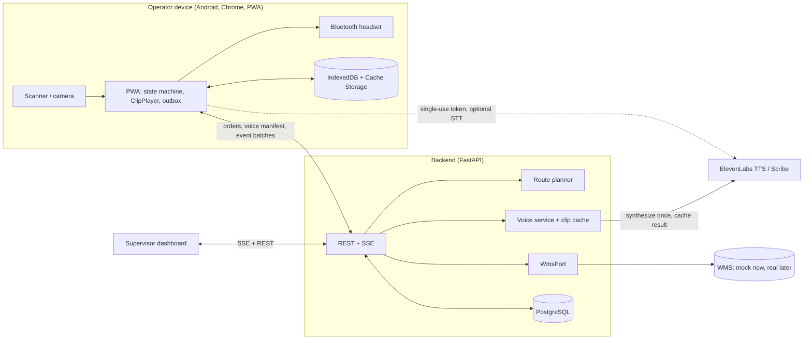

# Macenplast Voice Picking

A voice-guided picking system for Macenplast's storage and dispatch area.
Operators wear a Bluetooth headset and carry a scanner; the system speaks
each pick instruction in Spanish, the operator confirms by scanning a
barcode, and a mismatch blocks progress (Poka-Yoke). See `PLAN.md` for the
full build plan and `docs/adr/` for architecture decisions.

## Status

Building against `PLAN.md`'s phased plan. See `docs/PROGRESS.md` for what's
done so far.

## Architecture



## Repository layout

```
apps/
├── api/    # FastAPI backend (Python 3.12)
└── web/    # React + TypeScript PWA (Vite)
packages/machine-vectors/  # shared pick-machine test vectors (Python + TS)
tools/voice-clips/         # static ElevenLabs clip generator
analysis/                  # pilot analysis scripts
docs/                      # ADRs, progress log, runbook, protocols
```

## Development

Requires Docker Desktop.

```bash
cp .env.example .env
make up      # postgres + api + web, via docker compose
make test    # pytest + vitest
make lint    # ruff + mypy + eslint + tsc
make down
```

Without `make` installed, run the underlying commands directly — see the
`Makefile` for the exact commands each target runs.

- API: http://localhost:8000 (health check at `/health`)
- Web: http://localhost:5173

## Project rules

See `CLAUDE.md` for language, tooling, and workflow conventions.
