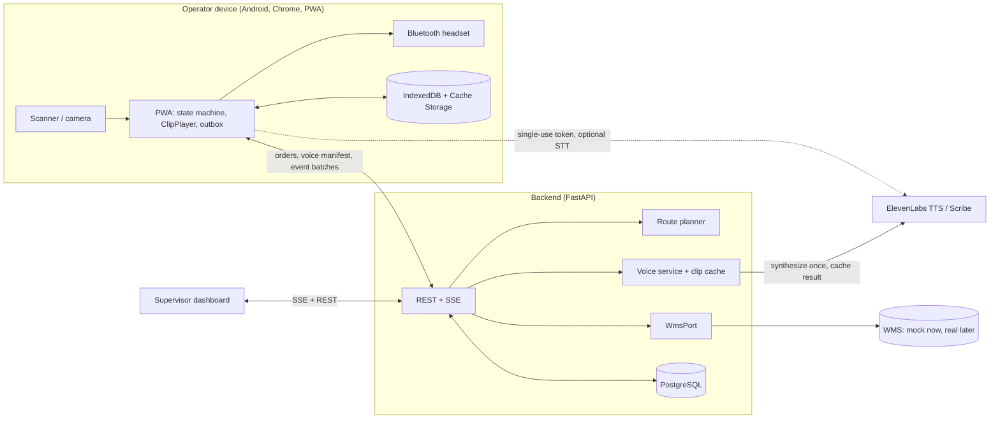

# Macenplast Voice Picking

A voice-guided picking system for Macenplast's storage and dispatch area.
Operators wear a Bluetooth headset and carry a scanner; the system speaks
each pick instruction in Spanish, the operator confirms by scanning a
barcode, and a mismatch blocks progress (Poka-Yoke). See `PLAN.md` for the
full build plan and `docs/adr/` for architecture decisions.

## Status

MVP complete: Phases 0-5 of `PLAN.md` (repo bootstrap, domain model + pick
state machine, WMS port + routing, voice/TTS pipeline, backend API, and the
operator PWA's core voice-picking flow, offline-capable). Phases 6-9
(supervisor dashboard/KPI reporting, pilot protocol, feature-flagged voice
input, production hardening) remain — see `PLAN.md` and `docs/PROGRESS.md`
for what's done and the deviations recorded along the way.

Try it: `make up`, log in with badge `0001` / PIN `1234` at
http://localhost:5173, pick an order, and step through it — BASELINE mode
shows the instruction on screen, VOICE mode speaks it (falling back to the
browser's `speechSynthesis` without a real `ELEVENLABS_API_KEY`).

## Architecture



## Repository layout

```
apps/
├── api/    # FastAPI backend (Python 3.12)
└── web/    # React + TypeScript PWA (Vite)
packages/machine-vectors/  # shared pick-machine test vectors (Python + TS)
tools/voice-clips/         # static ElevenLabs clip generator
analysis/                  # pilot analysis scripts
docs/                      # ADRs, progress log, runbook, protocols
```

## Development

Requires Docker Desktop.

```bash
cp .env.example .env
make up      # postgres + api + web, via docker compose
make test    # pytest + vitest
make lint    # ruff + mypy + eslint + tsc
make down
```

Without `make` installed, run the underlying commands directly — see the
`Makefile` for the exact commands each target runs.

- API: http://localhost:8000 (health check at `/health`)
- Web: http://localhost:5173
- Postgres (host access only, e.g. for local Alembic/psql): `localhost:5442`
  — not 5432, to avoid clashing with any native Postgres install; see
  `docker-compose.yml`'s `postgres` service.

Database migrations run automatically when the `api` container starts. To
seed demo data (idempotent — safe to run repeatedly):

```bash
make seed
```

End-to-end tests (Playwright, real Chromium) drive the operator PWA
through a full order offline and back online against the real API and
Postgres — see `apps/web/e2e/`:

```bash
make e2e
```

## Project rules

See `CLAUDE.md` for language, tooling, and workflow conventions.
